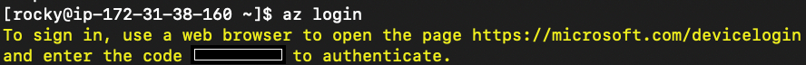
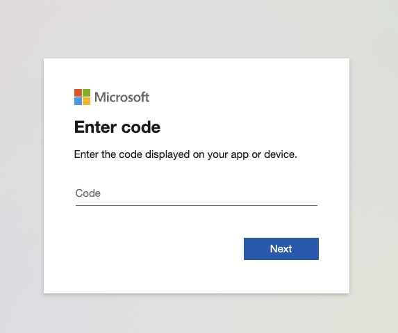
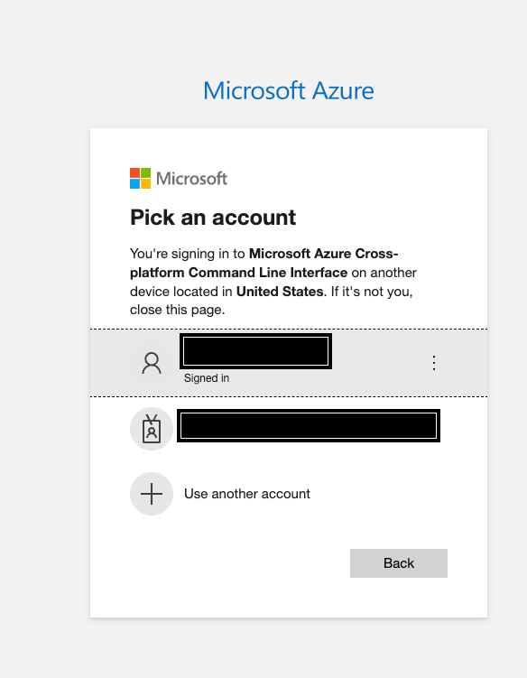
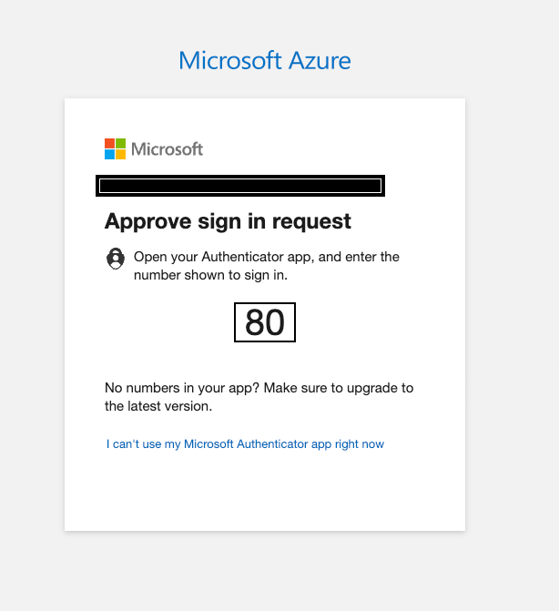
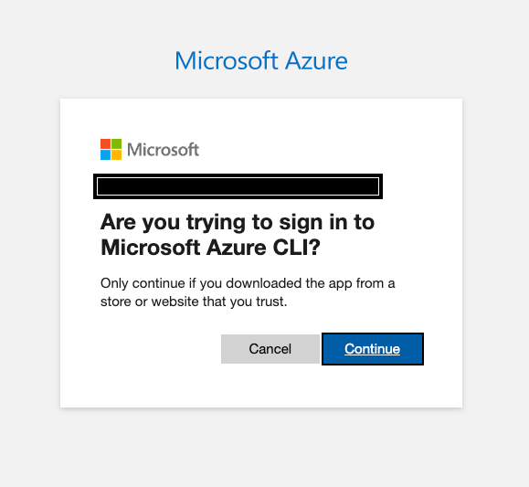
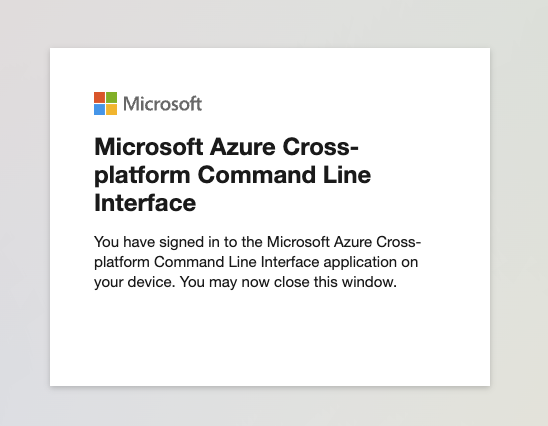
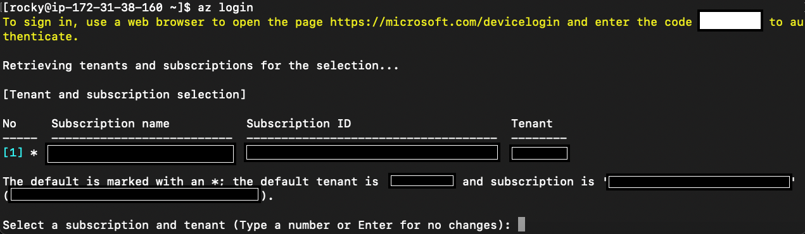

The Ascender installer is a script that makes for relatively easy
install of Ascender Automation Platform on Kubernetes platforms of
multiple flavors. The installer is being expanded to new Kubernetes
platforms as users/contributors allow, and if you have specific needs
for a platform not yet supported, please submit an issue to this
Github repository.

## Table of Contents

- [General Prerequisites](#general-prerequisites)
- [AKS-specific Prerequisites](#aks-specific-prerequisites)
- [Install Instructions](#install-instructions)
- [Uninstall Instructions](#uninstall-instructions)

## General Prerequisites

If you have not done so already, be sure to follow the general
prerequisites found in the [Ascender-Install main
README](../../README.md#general-prerequisites)

## AKS-specific Prerequisites

### AKS User, policy and tool requirements
- Before doing anything, you must have a valid Microsoft Azure subscription, and an account with access to that subscription, and appropriate permissions to create and manage an AKS cluster.
  - Instructions to create a new Microsoft accunt can be found here: [How to create a new Microsoft account](https://support.microsoft.com/en-us/account-billing/how-to-create-a-new-microsoft-account-a84675c3-3e9e-17cf-2911-3d56b15c0aaf)
  - Instructions to create a subscription can be found here: [Create a Microsoft Customer Agreement subscription](https://learn.microsoft.com/en-us/azure/cost-management-billing/manage/create-subscription)
- The Ascender installer for AKS requires installation of the [Azure Commmand Line Interface](https://learn.microsoft.com/en-us/cli/azure/) before it is invoked. Instructions for the Linux installer can be found at [this link](https://learn.microsoft.com/en-us/cli/azure/install-azure-cli-linux).
  - Once the Azure Command Line Interface is installed, run the following command to set the active Azure user to one with the appropriate permissions to run the Ascender installer on AKS: `$ az login`. 
    - If the Azure CLI can open your default browser, it initiates authorization code flow and opens the default browser to load an Azure sign-in page.
    - Otherwise, it initiates the [device code flow](https://learn.microsoft.com/en-us/azure/active-directory/develop/v2-oauth2-device-code) and instructs you to open a browser page at [https://aka.ms/devicelogin](https://aka.ms/devicelogin). Then, enter the code displayed in your terminal.
    - If no web browser is available or the web browser fails to open, you may force device code flow with az login --use-device-code.
    - Here are some images showing the general flow of authentication if your server cannot open a web browser directly:
      - Initial `az login` command with resulting random authentication code:
        - 
      - After going to https://microsoft.com/devicelogin, presentation of a field in which to paste/type the authentication code:
        - 
      - If you already have microsoft accounts, you can select an account to log into the az cli as:
        - 
      - If using multi-factor authentication with the Microsoft Authenticator app, you can see a prompt to approve sign in:
        - 
      - Verification that you are logging into Azure CLI:
        - 
      - Confirmation of successful sign in to Azure CLI:
        - 
      - Back on the Command Line, confirmation of sign in and selection of subcription to use for Microsoft Azure:
        - 


- The Ascender installer for AKS also expects Service Account/Service Principal credentials to be at ~/.azure/credentials to run modules from the azure.azcollection Ansible collection. This can be done be running the following after logging into Azure CLI:
  - List your subscriptions to get the subscription ID
    - `$ az account list --output table`
  - Create a Service Principal to obtain the client ID, client secret, and tenant ID
    - `$ az ad sp create-for-rbac --name <your-service-principal-name> --role Contributor --scopes /subscriptions/<your-subscription-id>`
    - This command will return JSON output with the appId (client ID), password (client secret), and tenant.
  - Create the ~/.azure directory if it doesn’t exist:
    - `mkdir -p ~/.azure`
  - Create the credentials file:
    - ```
         cat <<EOF > ~/.azure/credentials
         [default]
         subscription_id=<your-subscription-id>
         client_id=<your-client-id>
         secret=<your-client-secret>
         tenant=<your-tenant-id>
         EOF
      ```
  - Make sure the file has the correct permissions to protect your credentials
    - `$ chmod 600 ~/.azure/credentials`

## Install Instructions

### Obtain the sources

You can use the `git` command to clone the ascender-install repository or you can download the zipped archive. 

To use git to clone the repository run:

```
git clone https://github.com/ctrliq/ascender-install.git
```
This will create a directory named `ascender-install` in your present working directory (PWD).

We will refer to this directory as the `<repository root>` in the remainder of this instructions.

### Set the configuration variables for an aks Install

#### inventory file

You can copy the contents of [aks.inventory](./aks.inventory) in this directory, to `<repository root>`/inventory.

#### custom.config.yml file

You can run the bash script at 

```
<repository root>/config_vars.sh
```

The script will take you through a series of questions, that will populate the variables file requires to install Ascender. This variables file will be located at:

```
<repository root>/custom.config.yml
```

Afterward, you can simply edit this file should you not want to run the script again before installing Ascender.

The following variables will be present after running the script:

- `k8s_platform`: This variable specificies which Kubernetes platform Ascender and its components will be installed on.
- `k8s_protocol`: Determines whether to use HTTP or HTTPS for Ascender and Ledger.
- AKS_K8S_VERSION: The kubernetes version for the aks cluster; available kubernetes versions can be found here: [Supported Kubernetes versions in AKS](https://learn.microsoft.com/en-us/azure/aks/supported-kubernetes-versions?tabs=azure-cli)
- `USE_AZURE_DNS`: Determines whether to use Route53's Domain Management, or a third-party service such as Cloudflare, or GoDaddy. If this value is set to false, you will have to manually set a CNAME record for `ASCENDER_HOSTNAME` and `LEDGER_HOSTNAME` to point to the AWS Loadbalancers that the installer creates.
- `ASCENDER_HOSTNAME`: The DNS resolvable hostname for Ascender service.
- `LEDGER_HOSTNAME`: The DNS resolvable hostname for Ascender service.
- `ASCENDER_DOMAIN`: The Hosted Zone/Domain for all Ascender components. 
  - this is a SINGLE domain for both Ascender AND Ledger.
- `USE_AZURE_DNS`: Determines whether to use Azure DNS Domain Management, or a third-party service such as Cloudflare, or GoDaddy. If this value is set to false, you will have to manually set a CNAME record for `ASCENDER_HOSTNAME` and `LEDGER_HOSTNAME` to point to the AWS Loadbalancers that the installer creates.
- `AKS_CLUSTER_NAME`: The name of the aks cluster on which Ascender will be installed. This can be an existing aks cluster, or the name of the one to create.
- `AKS_CLUSTER_STATUS`: Determines whether to create a new cluster (`provision`) or use an existing cluster (`no_action`)
- `AKS_CLUSTER_REGION`: The Azure region in which a cluster that the installer creates should reside. 
- `AKS_INSTANCE_TYPE`: The aks worker node instance types
- `AKS_NUM_WORKER_NODES`: The desired number of aks worker nodes
- `AKS_WORKER_VOLUME_SIZE`: The volume size of aks worker nodes in GB
- `tls_crt_path`: TLS Certificate file location on the local installing machine
- `tls_key_path`: TLS Private Key file location on the local installing machine

### Run the setup script

To begin the setup process, from the <repository root> directory in this repository, type:

```
<repository root>/setup.sh
```

Once the setup is completed successfully, you should see a final output similar to:

```
...<OUTPUT TRUNCATED>...
PLAY RECAP *************************************************************************************************************************
ascender_host              : ok=14   changed=6    unreachable=0    failed=0    skipped=2    rescued=0    ignored=0
localhost                  : ok=72   changed=27   unreachable=0    failed=0    skipped=4    rescued=0    ignored=0

ASCENDER SUCCESSFULLY SETUP
```


### Connecting to Ascender Web UI

You can connect to the Ascender UI at https://`ASCENDER_HOST`

The username is and the corresponding password is stored in `<repository root>`/custom.config.yml under the `ASCENDER_ADMIN_USER` and `ASCENDER_ADMIN_PASSWORD` variables, respectively.


## Uninstall Instructions

After running `setup.sh`, `tmp_dir` will contain timestamped kubernetes manifests for:

- `ascender-deployment-{{ k8s_platform }}.yml`
- `ledger-{{ k8s_platform }}.yml` (if you installed Ledger)
- `kustomization.yml`

It will also contain a directory called `aks-deploy`, if you provisioned a new AKS cluster with the Ascender installer. This directory will contain the terraform state files and artifacts for your AKS cluster.

Remove the timestamp from the filename and then run the following
commands from within `tmp_dir``:

- `$ kubectl delete -f ascender-deployment-{{ k8s_platform }}.yml`
- `$ kubectl delete -f ledger-{{ k8s_platform }}.yml`
- `$ kubectl delete -k .`

To delete an AKS cluster created with the Ascender installer, run the following command from within the `tmp_dir`

- `$ terraform -chdir=aks_deploy/ destroy --auto-approve`