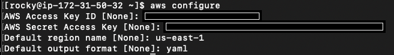

The Ascender installer is a script that makes for relatively easy
install of Ascender Automation Platform on Kubernetes platforms of
multiple flavors. The installer is being expanded to new Kubernetes
platforms as users/contributors allow, and if you have specific needs
for a platform not yet supported, please submit an issue to this
Github repository.

## Table of Contents

- [General Prerequisites](#general-prerequisites)
- [EKS-specific Prerequisites](#eks-specific-prerequisites)
- [Install Instructions](#install-instructions)

## General Prerequisites

If you have not done so already, be sure to follow the general
prerequisites found in the [Ascender-Install main
README](../../README.md#general-prerequisites)

## EKS-specific Prerequisites

### AWS User, policy and tool requirements
- Remember that the Enterprise Linux machine used to install Ascender on EKS must be of **major version 9, NOT 8**.
- The unzip rpm package must be installed: `$ sudo dnf install unzip -y` 
- The Ascender installer for EKS requires installation of the [AWS Commmand Line Interface](https://aws.amazon.com/cli/) before it is invoked. Instructions for the Linux installer can be found at [this link](https://docs.aws.amazon.com/cli/latest/userguide/getting-started-install.html#cliv2-linux-install).
  - Be certain to place the `aws` binary at `/usr/local/bin/`, as the Ascender installer will look for it there.
  - Once the AWS Command Line Interface is installed, run the following command to set the active aws user to one with the appropriate permissions to run the Ascender installer on EKS: `$ aws configure`.
    - The AWS CLI requires Programmatic access to AWS: Instructions on setting up Programmatic access can be found here: [AWS security credentials: Programmatic Access](https://docs.aws.amazon.com/IAM/latest/UserGuide/security-creds.html#sec-access-keys-and-secret-access-keys)
    - **Be sure to ensure that the user that will be installing ascender has appropriate access to create an EKS cluster.**
    - An example of setting up these programmatic credentials can be found here:
      - 
- Although not required before install, The Ascender installer for EKS will set up and use the EKS CLI tool, `eksctl`, in order to configure parts of your eks cluster.

## Install Instructions

### Obtain the sources

You can use the `git` command to clone the ascender-install repository or you can download the zipped archive. 

To use git to clone the repository run:

```
git clone https://github.com/ctrliq/ascender-install.git
```
This will create a directory named `ascender-install` in your present working directory (PWD).

We will refer to this directory as the `<repository root>` in the remainder of this instructions.

### Set the configuration variables for an eks Install

#### inventory file

You can copy the contents of [eks.inventory](./eks.inventory) in this directory, to `<repository root>`/inventory.

#### custom.config.yml file

You can run the bash script at 

```
<repository root>>/config_vars.sh
```

The script will take you through a series of questions, that will populate the variables file requires to install Ascender. This variables file will be located at:

```
<repository root>/custom.config.yml
```

Afterward, you can simply edit this file should you not want to run the script again before installing Ascender.

The following variables will be present after running the script:

- `k8s_platform`: This variable specificies which Kubernetes platform Ascender and its components will be installed on.
- `k8s_protocol`: Determines whether to use HTTP or HTTPS for Ascender and Ledger.
- `USE_ROUTE_53`: Determines whether to use Route53's Domain Management, or a third-party service such as Cloudflare, or GoDaddy. If this value is set to false, you will have to manually set a CNAME record for `ASCENDER_HOSTNAME` and `LEDGER_HOSTNAME` to point to the AWS Loadbalancers that the installer creates.
- `ASCENDER_HOSTNAME`: The DNS resolvable hostname for Ascender service.
- `LEDGER_HOSTNAME`: The DNS resolvable hostname for Ascender service.
- `ASCENDER_DOMAIN`: The Hosted Zone/Domain for all Ascender components. 
  - this is a SINGLE domain for both Ascender AND Ledger.
- `EKS_CLUSTER_NAME`: The name of the eks cluster on which Ascender will be installed. This can be an existing eks cluster, or the name of the one to create, should the `eksctl` tool not find this name amongst its existing clusters.
- `EKS_CLUSTER_REGION`: The AWS region hosting the eks cluster
- `EKS_K8S_VERSION`: The kubernetes version for the eks cluster; available kubernetes versions can be found [here](https://docs.aws.amazon.com/eks/latest/userguide/kubernetes-versions.html)
- `EKS_INSTANCE_TYPE`: The worker node instance type. 
- `EKS_MIN_WORKER_NODES`: The minimum number of worker nodes that the cluster will run
- `EKS_MAX_WORKER_NODES`: The maximum number of worker nodes that the cluster will run
- `EKS_NUM_WORKER_NODES`: The desired number of worker nodes for the eks cluster
- `EKS_WORKER_VOLUME_SIZE`: The size of the Elastic Block Storage volume for each worker node
- `tls_crt_path`: TLS Certificate file location on the local installing machine
- `tls_key_path`: TLS Private Key file location on the local installing machine

### Run the setup script

To begin the setup process, from the <repository root> directory in this repository, type:

```
sudo <repository root>/setup.sh
```

Once the setup is completed successfully, you should see a final output similar to:

```
...<OUTPUT TRUNCATED>...
PLAY RECAP *************************************************************************************************************************
ascender_host              : ok=14   changed=6    unreachable=0    failed=0    skipped=2    rescued=0    ignored=0
localhost                  : ok=72   changed=27   unreachable=0    failed=0    skipped=4    rescued=0    ignored=0

ASCENDER SUCCESSFULLY SETUP
```


### Connecting to Ascender Web UI

You can connect to the Ascender UI at https://`ASCENDER_HOST`

The username is and the corresponding password is stored in `<repository root>`/custom.config.yml under the `ASCENDER_ADMIN_USER` and `ASCENDER_ADMIN_PASSWORD` variables, respectively.


## Uninstall Instructions

After running `setup.sh`, `tmp_dir` will contain timestamped kubernetes manifests for:

- `ascender-deployment-{{ k8s_platform }}.yml`
- `ledger-{{ k8s_platform }}.yml` (if you installed Ledger)
- `kustomization.yml`

Remove the timestamp from the filename and then run the following
commands from within `tmp_dir``:

- `$ kubectl delete -f ascender-deployment-{{ k8s_platform }}.yml`
- `$ kubectl delete pvc -n {{ ASCENDER_NAMESPACE }} postgres-15-ascender-app-postgres-15-0 (If you used the default postgres database)
- `$ kubectl delete -f ledger-{{ k8s_platform }}.yml`
- `$ kubectl delete -k .`

**NOTE** A loadbalancer may still be left over, accessible from within the AWS GUI Console, under the EC2 Service page. Its DNS Name will match the CNAME record in either Route53 or whatever DNS resolution service you elected to use. You must manually delete it before destroying the EKS cluster with Terraform.

To delete an EKS cluster created with the Ascender installer, run the following command from within the `tmp_dir`

- `$ terraform -chdir=eks_deploy/ destroy --auto-approve`