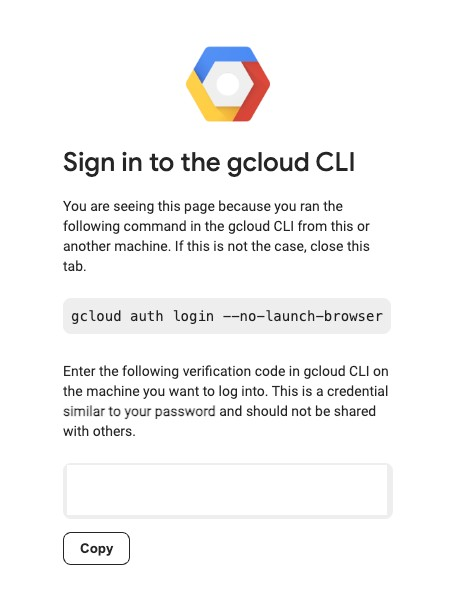
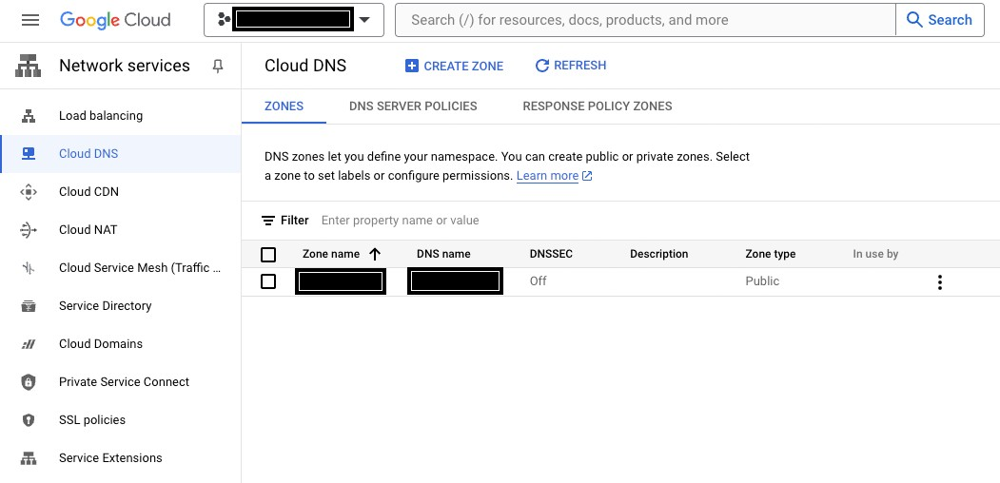

The Ascender installer is a script that makes for relatively easy
install of Ascender Automation Platform on Kubernetes platforms of
multiple flavors. The installer is being expanded to new Kubernetes
platforms as users/contributors allow, and if you have specific needs
for a platform not yet supported, please submit an issue to this
Github repository.

## Table of Contents

- [General Prerequisites](#general-prerequisites)
- [GKE-specific Prerequisites](#gke-specific-prerequisites)
- [Install Instructions](#install-instructions)
- [Uninstall Instructions](#uninstall-instructions)

## General Prerequisites

If you have not done so already, be sure to follow the general
prerequisites found in the [Ascender-Install main
README](../../README.md#general-prerequisites)

## GKE-specific Prerequisites

### GKE User, policy and tool requirements
- Remember that the Enterprise Linux machine used to install Ascender on GKE must be of **major version 9, NOT 8**.
- The first step for running the Ascender installer will be to create a Google Cloud Project in which to create the GKE cluster, in the Google Cloud Web console. A Google Cloud Project is a resource container within Google Cloud Platform (GCP) that organizes and manages resources like virtual machines, databases, and storage. It provides boundaries for access control, billing, and quotas.
  - Instructions on how to create a Google Cloud Project can be found here: [Creating and managing projects](https://cloud.google.com/resource-manager/docs/creating-managing-projects)
- Next, the Ascender installer for GKE requires installation of the [gcloud Commmand Line Interface](https://cloud.google.com/cli) before it is invoked. Instructions for the Linux installer can be found at [this link](https://cloud.google.com/sdk/docs/install#rpm).
  - Once the gcloud Commmand Line Interface is installed, run the following command to set the active Google Cloud user to one with the appropriate permissions to run the Ascender installer on GKE: `gcloud init`. This will open a web browser tab that will prompt you to sign in with your Google account, and provide a verfication code that will be used back on the command line. Then, it will take you through options of the active project and region/zone. The existing projects and regions/zones will be presented as a list you can choose from and you can select the project you created.
    - 
  - Lastly, create [Application Default Credentials](https://cloud.google.com/sdk/gcloud/reference/auth/application-default/login) 
    - `$ gcloud auth application-default login`

  - If you already have the gCloud Command Line Interface installed and are logged in and need to select a project only, you can do this in one of two ways:
    - `$ gcloud config set project PROJECT_ID`
        - This command will set the active project for the gcloud SDK user, and you must know the name of the project ID.
      - `$ gcloud init`
        - This command will take you through options of the active project and region/zone. The existing projects and regions/zones will be presented as a list you can choose from.

- There are some other google cloud components that are required:  
  - Ensure that the latest version of all installed components is installed, by one of two methods:
    - `$ gcloud components update`
    - If the gcloud Commmand Line Interface is installed in such a way that the Google Cloud CLI component manager is disabled, you can run the following command instead:
      - ``` sudo yum makecache && sudo yum update google-cloud-sdk-enterprise-certificate-proxy google-cloud-sdk-app-engine-python-extras google-cloud-sdk-app-engine-go google-cloud-sdk google-cloud-sdk-bundled-python3 google-cloud-sdk-bigtable-emulator google-cloud-sdk-package-go-module google-cloud-sdk-nomos kubectl google-cloud-sdk-spanner-emulator google-cloud-sdk-app-engine-java google-cloud-sdk-anthos-auth google-cloud-sdk-terraform-tools google-cloud-sdk-pubsub-emulator google-cloud-sdk-minikube google-cloud-sdk-gke-gcloud-auth-plugin google-cloud-sdk-cloud-build-local google-cloud-sdk-skaffold google-cloud-sdk-spanner-migration-tool google-cloud-sdk-app-engine-python google-cloud-sdk-kubectl-oidc google-cloud-sdk-datastore-emulator google-cloud-sdk-harbourbridge google-cloud-sdk-kpt google-cloud-sdk-firestore-emulator google-cloud-sdk-log-streaming google-cloud-sdk-cloud-run-proxy google-cloud-sdk-app-engine-grpc google-cloud-sdk-cbt google-cloud-sdk-config-connector google-cloud-sdk-local-extract google-cloud-cli-docker-credential-gcr google-cloud-sdk-istioctl ```


In order to run the Ascender installer for GKE, some Google Cloud artifacts must be created manually:
- APIs within the Project must be enabled:
  - [Cloud DNS API](https://console.cloud.google.com/marketplace/product/google/dns.googleapis.com)
  - [Kubernetes Engine API](https://console.cloud.google.com/marketplace/product/google/container.googleapis.com)
- If you plan to use Google [Cloud DNS](https://cloud.google.com/dns) to resolve your URLs for Ascender, you must do the following within Cloud DNS:
  - Create a hosted zone within Google Cloud DNS. A Google Cloud DNS hosted zone is a container for managing DNS records for a specific domain within Google Cloud Platform (GCP). It allows you to define how DNS queries for your domain are resolved.
  - Instructions for creating a hosted zone are here: [Create, modify, and delete zones](https://cloud.google.com/dns/docs/zones). This assumes you already have a domain registered. After you have created your zone, it should appear like this:
    - 
  - The entry under `Zone name` will be required to use as the variable `GOOGLE_DNS_MANAGED_ZONE`, and the field under `DNS name` will be used as the install variable `ASCENDER_DOMAIN`.


## Install Instructions

### Obtain the sources

You can use the `git` command to clone the ascender-install repository or you can download the zipped archive. 

To use git to clone the repository run:

```
git clone https://github.com/ctrliq/ascender-install.git
```
This will create a directory named `ascender-install` in your present working directory (PWD).

We will refer to this directory as the `<repository root>` in the remainder of this instructions.

### Set the configuration variables for an gke Install

#### inventory file

You can copy the contents of [gke.inventory](./gke.inventory) in this directory, to `<repository root>`/inventory.
  - **Be sure to set the ansible_user variable for both the ansible_host and localhost to match the linux user that will be running the installer.**


#### custom.config.yml file

You can run the bash script at 

```
<repository root>/config_vars.sh
```

The script will take you through a series of questions, that will populate the variables file requires to install Ascender. This variables file will be located at:

```
<repository root>/custom.config.yml
```

Afterward, you can simply edit this file should you not want to run the script again before installing Ascender.

The following variables will be present after running the script:

- `k8s_platform`: This variable specificies which Kubernetes platform Ascender and its components will be installed on.
- `k8s_protocol`: Determines whether to use HTTP or HTTPS for Ascender and Ledger.
- `USE_GOOGLE_DNS`: Determines whether to use Google Cloud DNS Domain Management (which is automated), Or a third-party service (e.g., Cloudflare, GoDaddy, etc.)
- `GKE_CLUSTER_NAME`: The name of the gke cluster to install Ascender on - if it does not already exist, the installer can set it up
- `GKE_CLUSTER_STATUS`: Specifies whether the GKE cluster needs to be provisioned (provision), exists but needs to be configured to support Ascender (configure), or exists and needs nothing done before installing Ascender (no_action)
- `GKE_CLUSTER_ZONE`: The Google Cloud zone hosting the gke cluster
- `GKE_K8S_VERSION`: The kubernetes version for the gke cluster
- `GKE_INSTANCE_TYPE`: The gke worker node instance types
- `GKE_NUM_WORKER_NODES`: The desired number of gke worker nodes
- `GKE_WORKER_VOLUME_SIZE`: The volume size of gke worker nodes in GB
- `tls_crt_path`: TLS Certificate file location on the local installing machine
- `tls_key_path`: TLS Private Key file location on the local installing machine
- `GOOGLE_DNS_MANAGED_ZONE`: In Google Cloud DNS the name of an existing hosted DNS zone for your DNS record.

### Run the setup script

To begin the setup process, from the <repository root> directory in this repository, type:

```
<repository root>/setup.sh
```

Once the setup is completed successfully, you should see a final output similar to:

```
...<OUTPUT TRUNCATED>...
PLAY RECAP *************************************************************************************************************************
ascender_host              : ok=14   changed=6    unreachable=0    failed=0    skipped=2    rescued=0    ignored=0
localhost                  : ok=72   changed=27   unreachable=0    failed=0    skipped=4    rescued=0    ignored=0

ASCENDER SUCCESSFULLY SETUP
```


### Connecting to Ascender Web UI

You can connect to the Ascender UI at https://`ASCENDER_HOST`

The username is and the corresponding password is stored in `<repository root>`/custom.config.yml under the `ASCENDER_ADMIN_USER` and `ASCENDER_ADMIN_PASSWORD` variables, respectively.


## Uninstall Instructions

After running `setup.sh`, `tmp_dir` will contain timestamped kubernetes manifests for:

- `ascender-deployment-{{ k8s_platform }}.yml`
- `ledger-{{ k8s_platform }}.yml` (if you installed Ledger)
- `kustomization.yml`

It will also contain a directory called `gke-deploy`, if you provisioned a new GKE cluster with the Ascender installer. This directory will contain the terraform state files and artifacts for your GKE cluster.

Remove the timestamp from the filename and then run the following
commands from within `tmp_dir``:

- `$ kubectl delete -f ascender-deployment-{{ k8s_platform }}.yml`
- `$ kubectl delete pvc -n {{ ASCENDER_NAMESPACE }} postgres-15-ascender-app-postgres-15-0 (If you used the default postgres database)
- `$ kubectl delete -f ledger-{{ k8s_platform }}.yml`
- `$ kubectl delete -k .`

To delete an GKE cluster created with the Ascender installer, run the following command from within the `tmp_dir`

- `$ terraform -chdir=gke_deploy/ destroy --auto-approve`