# awx_migrate_ascender

Migrates an AWX 24.6.1 instance to Ascender on Kubernetes. Pulls the latest AWX backup from S3, restores the database with parallel `pg_restore -j 16` (vs the operator's single-threaded pipe, ~45 min to ~9 min for a 5GB compressed / 56GB expanded database), applies Django migrations, and patches the CR. Based on CtrlIQ's `ascender_migrate` role pattern.

## Table of contents

- [Background](#background)
  - [Why not use AWXRestore CR](#why-not-use-awxrestore-cr)
  - [Secrets: what we patch, what we skip, and why](#secrets-what-we-patch-what-we-skip-and-why)
  - [Django migration divergence (AWX 24.6.1 vs Ascender)](#django-migration-divergence-awx-2461-vs-ascender)
  - [DAB RBAC: the shadow permission system](#dab-rbac-the-shadow-permission-system)
- [Flow](#flow)
- [Prerequisites](#prerequisites)
- [Usage](#usage)
  - [Full restore (first run)](#full-restore-first-run)
  - [Common rerun scenarios](#common-rerun-scenarios)
  - [CLI (for local testing)](#cli-for-local-testing)
- [Variables](#variables)
- [Data-driven configuration](#data-driven-configuration)
  - [secret_patches](#secret_patches)
  - [migration_steps](#migration_steps)
  - [cr_patch](#cr_patch)
- [Detailed flow](#detailed-flow)
  - [PVC layout](#pvc-layout-role-managed-restore-pvc-100gi)
  - [Step 1: prep.yml](#step-1-prepyml)
  - [Step 2: download.yml](#step-2-downloadyml)
  - [Step 3: secrets.yml](#step-3-secretsyml)
  - [Step 4: pg_restore.yml](#step-4-pg_restoreyml)
  - [Step 5: migrate.yml](#step-5-migrateyml)
  - [Step 6: cleanup.yml](#step-6-cleanupyml)
  - [Step 7: patch_cr.yml](#step-7-patch_cryml)
  - [Step 8: startup.yml](#step-8-startupyml)
  - [Step 9: configure.yml](#step-9-configureyml)
  - [Step 10: verify.yml](#step-10-verifyyml)
- [Restore performance tuning](#restore-performance-tuning)
  - [Why the database is so large](#why-the-database-is-so-large)
- [Differences from CIQ ascender_migrate](#differences-from-ciq-ascender_migrate)
- [AWX CR spec: awx_object and what the operator does with it](#awx-cr-spec-awx_object-and-what-the-operator-does-with-it)
  - [Field classification](#field-classification)
  - [What the operator restore does vs what we do](#what-the-operator-restore-does-vs-what-we-do)
- [File structure](#file-structure)
- [Kubernetes resources created](#kubernetes-resources-created)
- [Vault secrets](#vault-secrets)
- [Troubleshooting](#troubleshooting)
  - [pg_restore fails](#pg_restore-fails)
  - [No space left on device during pg_restore](#no-space-left-on-device-during-pg_restore)
  - [Migration errors](#migration-errors)
  - [Credentials don't decrypt after restore](#credentials-dont-decrypt-after-restore)
  - [Monitoring pg_restore progress](#monitoring-pg_restore-progress)
  - [Rerunning from a specific phase](#rerunning-from-a-specific-phase)
- [References](#references)

## Background

This role takes an AWX database backup in native AWXBackup format (`tower.db`, `secrets.yml`, `awx_object`) stored on S3-compatible storage and imports it into an Ascender instance running on Kubernetes.

### Why not use AWXRestore CR

The AWX operator's AWXRestore CR pipes the dump through `cat tower.db | pg_restore`. This is single-threaded because the `-j` flag is not possible with stdin. A 56GB database with 37,000+ indexes across 6,600+ partitions takes ~45 minutes this way. By running `pg_restore --verbose -j 16 --clean --if-exists` directly from a file, we parallelize data loading and index creation for a ~5x speedup. We handle secrets and operator reconciliation ourselves.

### Secrets: what we patch, what we skip, and why

After pg_restore loads AWX's data, some K8s secrets must be updated to match the source. The list is data-driven via `secret_patches` in `vars/main.yml`. Each entry maps a backup key (`src_key`) to a destination K8s secret (`dest_name`). Optional secrets are skipped if not found in the backup.

Source and destination instance names differ (e.g. `my-awx` vs `my-ascender`). The `source_awx_instance` survey var handles the name mapping. Add or remove entries in `secret_patches` to control what transfers.

Verified by comparing all secrets between source AWX and destination Ascender namespaces. Key structures match on both sides.

<details open>
<summary><strong>Patched by role.</strong> These secrets are copied from the AWX backup into Ascender.</summary>

| Source AWX secret | Key(s) | Ascender secret | Why patch |
|---|---|---|---|
| `<source>-secret-key` | `secret_key` | `<instance>-secret-key` | Fernet key for credential encryption. Without it, all imported credentials are garbage. |
| `<source>-admin-password` | `password` | `<instance>-admin-password` | Operator reads this on reconcile and would overwrite the restored DB hash. |
| `<source>-receptor-ca` | `tls.crt`, `tls.key` | `<instance>-receptor-ca` | CA cert that execution nodes trust. Nodes won't connect without it. |
| `<source>-receptor-work-signing` | `work-private-key.pem`, `work-public-key.pem` | `<instance>-receptor-work-signing` | Keypair for signing job payloads. |
| `ldap-ca-crt` | `ca.crt`, `ldap-ca.crt` | `ldap-ca-crt` | LDAP/AD CA cert for authentication. Same name on both sides. Optional in `secret_patches` (skipped if not in backup). |

</details>

<details open>
<summary><strong>Not patched.</strong> These are operator-generated or destination-specific.</summary>

| Source AWX secret | Key(s) | Ascender secret | Why skip |
|---|---|---|---|
| `<source>-app-credentials` | `credentials.py`, `execution_environments.py`, `ldap.py` | `<instance>-app-credentials` | 3 Python config files mounted into web/task/migration pods. `credentials.py` has Django DB settings + broadcast websocket secret. `ldap.py` has LDAP TLS config + optional bind password. `execution_environments.py` has the EE list from `ee_images`. Operator regenerates all 3 files on every reconcile from CR spec and other secrets, so patching would be overwritten immediately. Source: `awx-operator/roles/installer/templates/secrets/app_credentials.yaml.j2`, `roles/installer/defaults/main.yml`. |
| `<source>-broadcast-websocket` | `secret` | `<instance>-broadcast-websocket` | HMAC-SHA256 key for the internal websocket relay between web and task pods. Used only for intra-cluster web/task communication, not for execution nodes or instance groups (those use receptor). Operator preserves existing value if present, generates a new one only on first install. Safe to skip because the destination gets its own key. Source: `awx/docs/websockets.md`, `awx-operator/roles/installer/tasks/broadcast_websocket_configuration.yml`. |
| `<source>-postgres-configuration` | `database`, `host`, `password`, `port`, `type`, `username` | `<instance>-postgres-configuration` | Points to the destination postgres instance. Ascender install creates this with correct credentials. |
| `<source>-image-pull-secret` | `.dockerconfigjson` | *(destination equivalent)* | Different names, both handle image pulls. Ascender's was created by its install. |
| `<source>-s3-backup-configuration` | `S3_BUCKET`, `S3_HOST`, `S3_KEY`, `S3_SECRET` | *(not present)* | Backup storage config. Destination doesn't run backups. |
| `redhat-operators-pull-secret` | `operator` | `redhat-operators-pull-secret` | Same on both sides. Created by cluster, not by the role. |
| `*-dockercfg-*`, `*-token-*`, `builder-*`, `default-*`, `deployer-*` | service account tokens | *(auto-generated)* | OpenShift service account secrets. Auto-generated per namespace. |

</details>

### Django migration divergence (AWX 24.6.1 vs Ascender)

AWX and Ascender are Python web applications built on [Django](https://www.djangoproject.com/), a web framework. Django manages database schema changes through **migrations**. These are Python files that describe how to modify tables, columns, indexes, and constraints. Each migration is a small, versioned step. For example, `0180_add_hostmetric_fields` adds a unique constraint to the `main_hostmetric` table. Migrations are applied in order, and Django tracks which ones have been applied in a table called `django_migrations`. Each row contains an app name, migration name, and applied timestamp.

When `awx-manage migrate` runs, Django compares the migration files on disk against the rows in `django_migrations`. If a migration file exists but has no matching row, Django tries to apply it by running the SQL to alter the schema. If a row exists, Django skips it because the schema change was already made.

**"Faking" a migration** means inserting a row into `django_migrations` without actually running the migration's SQL. This tells Django "this migration was already applied, skip it."

#### Why the migration histories diverge

AWX and Ascender forked from the same codebase. The role migrates directly from AWX 24.6.1 to Ascender 25.3.5 in a single step. The `migration_fix.sh.j2` template clears DAB RBAC shadow data before migrations run, which avoids the content type collision that would otherwise block `dab_rbac` migration 0005. No intermediate 25.2.0 lateral move is needed.

Both projects continued adding migrations independently. Migrations 0180-0182 are identical. From 0183 onward, Ascender inserted extra migrations into the chain (0183_auto, 0184_alter_credentialtype_kind, 0186a, 0187a) that don't exist in AWX. Several migrations share the same name but have different dependency chains or slightly different content.

The table below was built by diffing the actual migration files between AWX 24.6.1 and Ascender 25.3.5 source trees. Migrations are grouped by what the role does with them.

<details open>
<summary><strong>Identical (0180-0182).</strong> Shared baseline, no action needed.</summary>

These exist in both AWX and Ascender with identical content. They remain in `django_migrations` untouched.

| # | Migration |
|---|---|
| 0180 | `0180_add_hostmetric_fields` |
| 0181 | `0181_hostmetricsummarymonthly` |
| 0182 | `0182_constructed_inventory` |

</details>

<details open>
<summary><strong>Faked (0183-0190).</strong> AWX already applied the schema. We record it for Ascender.</summary>

These migrations exist in both forks with identical or equivalent schema operations. AWX already created the tables/columns/indexes, so running them again would fail ("already exists"). We fake them so Django records them as applied without executing SQL.

Some need faking because the dependency chain differs (Ascender inserted extra migrations). Others are identical but their `django_migrations` records were deleted in the cleanup step because they depended on deleted records.

| # | Migration | Why fake |
|---|---|---|
| 0183 | `0183_pre_django_upgrade` | Formatting-only diff. Same schema ops. |
| 0184 | `0184_django_indexes` | Same ops, different dependency chain |
| 0185 | `0185_move_JSONBlob_to_JSONField` | Identical. Record deleted (depended on 0184) |
| 0186 | `0186_drop_django_taggit` | Identical. Record deleted (depended on 0185) |
| 0187 | `0187_hop_nodes` | Same ops, different dependency chain |
| 0188 | `0188_add_bitbucket_dc_webhook` | Same ops, different dependency chain |
| 0189 | `0189_inbound_hop_nodes` | Identical. Record deleted (depended on 0188) |
| 0190 | `0190_alter_inventorysource_source_and_more` | Same name, different content. Both AlterField on choices = no-op in postgres |

</details>

<details open>
<summary><strong>Applied (Ascender-only).</strong> New migrations that Django runs natively.</summary>

These only exist in Ascender. Django runs the actual Python/SQL.

| # | Migration | What it does |
|---|---|---|
| 0183 | `0183_auto_20230522_2151` | 5x AlterField on choices (no-op in postgres) |
| 0184 | `0184_alter_credentialtype_kind` | AlterField + RunPython DELETE of 4 Red Hat credential types |
| 0186a | `0186a_disable_NEXT_UI` | RunSQL to disable UI_NEXT setting |
| 0187a | `0187a_mountain_credential` | RunPython `setup_tower_managed_defaults` |
| 0191 | `0191_alter_inventorysource_source_and_more` | Replaces AWX's `0191_add_django_permissions` (different migration, same number) |
| 0191a | `0191a_add_depot_credential` | RunPython `setup_tower_managed_defaults` |
| 0192 | `0192_alter_instance_peers_alter_job_hosts_and_more` | AlterField on instance peers, job hosts, etc. (25.3.5+) |
| 0193 | `0193_alter_inventorysource_source_and_more` | AlterField on inventorysource choices (25.3.5+) |
| 0194 | `0194_add_github_app_credential` | RunPython `setup_tower_managed_defaults` for GitHub App credential type (25.3.5+) |

</details>

<details open>
<summary><strong>Deleted (AWX-only, 0191-0195).</strong> Removed in migration cleanup.</summary>

These exist only in AWX. Their `django_migrations` records are deleted by the `DELETE WHERE name >= '0183'` cleanup so they don't block Ascender's dependency chain.

| # | Migration |
|---|---|
| 0191 | `0191_add_django_permissions` |
| 0192 | `0192_custom_roles` |
| 0193 | `0193_alter_notification_notification_type_and_more` |
| 0194 | `0194_alter_inventorysource_source_and_more` |
| 0195 | `0195_EE_permissions` |

</details>

<details open>
<summary><strong>dab_resource_registry (0005-0007).</strong> Separate app, applied after main.</summary>

The `dab_resource_registry` app (from `django-ansible-base`) has its own migration chain. AWX 24.6.1 has 0001-0004 applied. Ascender 25.3.5 ships with migrations through 0007. All three are applied natively by `awx-manage migrate dab_resource_registry --noinput`.

| # | Migration | What it does |
|---|---|---|
| 0005 | `0005_resource_is_partially_migrated_and_more` | Adds `is_partially_migrated` field + AlterField on `service_id` |
| 0006 | `0006_alter_resource_service_id` | AlterField on `service_id` help text |
| 0007 | `0007_alter_resource_ansible_id_and_more` | AlterField on several fields (help text, minor schema) |

</details>

After pg_restore loads AWX's database, the `django_migrations` table contains AWX's migration records. Django checks the full dependency chain of every applied migration BEFORE running any command, including `--fake`. If `0185` is applied but its dependency `0184_django_indexes` has been deleted, Django throws `InconsistentMigrationHistory` immediately. It never gets a chance to apply or fake the missing migration. This means partial deletion of records is not possible. All records from 0183 onward must be deleted together so the dependency chain is clean.

#### How we handle it

We take full control of migrations BEFORE the operator starts. The web deployment is temporarily scaled up so we can exec `awx-manage migrate` in the web pod. There is no reverse-engineered SQL and no manual INSERT statements. The migration script is a data-driven loop over `migration_steps` defined in `vars/main.yml`. Each step specifies a target migration and an action (fake or apply). Django processes all migrations between the last applied and the target. Upgrading Ascender versions means updating the step list, not the script.

CIQ's upstream `ascender_migrate` role ([Issue #177](https://github.com/ctrliq/ascender-install/issues/177), [PR #182](https://github.com/ctrliq/ascender-install/pull/182)) solves this same problem by deleting all 018x/019x records and running `awx-manage migrate --fake` with `ignore_errors: yes`. We follow the same strategy but are more precise and fail loud on unexpected issues.

**Step 1: Delete old migration job (prep phase)**

The stale migration job from the original Ascender install says "migrations done" but the database now has AWX data. Deleting it forces the operator to create a fresh migration job when it starts back up.

**Step 2: Clean up django_migrations (pg_restore phase)**

Delete ALL main app migration records from 0183 onward. Partial deletion is not possible because Django checks the full dependency chain before running any command. For example, deleting `0184_django_indexes` while `0185` still has a record fails because `0185` depends on `0184_django_indexes`.

```sql
DELETE FROM django_migrations WHERE app = 'main' AND name >= '0183';
```

After this, django_migrations has only: 0180, 0181, 0182. All shared and identical between AWX and Ascender.

**Step 3: Run awx-manage migrate in the web pod (migrate phase)**

The web deployment is temporarily scaled to 1 replica. We exec `awx-manage migrate` in the web pod, which already has the correct image, volume mounts, and PATH configured. The migration script is a loop over `migration_steps` defined in `vars/main.yml`:

```yaml
migration_steps:
  # fake = AWX already applied identical schema, just record it
  # apply = Ascender-only, Django runs the actual Python/SQL

  - { target: "0183_pre_django_upgrade", action: fake }
    # AWX applied identical schema

  - { target: "0184_alter_credentialtype_kind", action: apply }
    # Ascender-only: applies 0183_auto + 0184_alter
    # (DELETE Red Hat credential types)

  - { target: "0186_drop_django_taggit", action: fake }
    # AWX applied: fakes 0184_django_indexes, 0185, 0186

  - { target: "0186a_disable_NEXT_UI", action: apply }
    # Ascender-only: RunSQL disable UI_NEXT setting

  - { target: "0187_hop_nodes", action: fake }
    # AWX applied identical schema

  - { target: "0187a_mountain_credential", action: apply }
    # Ascender-only: register Mountain credential type

  - { target: "0190_alter_inventorysource_source_and_more", action: fake }
    # AWX applied: fakes 0188, 0189, 0190

  - { action: apply }
    # Ascender-only: applies 0191 through 0194 (all remaining)
```

Each step calls `awx-manage migrate main <target> [--fake] --noinput`. A key Django behavior: when you specify a target, Django does not just process that one migration. It processes **every unapplied migration between the last applied and the target**, walking the dependency chain. This is how one step can handle multiple migrations:

| Step | Target | Action | Last applied before step | Migrations processed |
|------|--------|--------|--------------------------|----------------------|
| 1 | `0183_pre_django_upgrade` | fake | `0182` | `0183_pre` (1 migration) |
| 2 | `0184_alter_credentialtype_kind` | apply | `0183_pre` | `0183_auto` + `0184_alter` (2 migrations) |
| 3 | `0186_drop_django_taggit` | fake | `0184_alter` | `0184_django_indexes` + `0185` + `0186` (3 migrations) |
| 4 | `0186a_disable_NEXT_UI` | apply | `0186` | `0186a` (1 migration) |
| 5 | `0187_hop_nodes` | fake | `0186a` | `0187` (1 migration) |
| 6 | `0187a_mountain_credential` | apply | `0187` | `0187a` (1 migration) |
| 7 | `0190_alter_...` | fake | `0187a` | `0188` + `0189` + `0190` (3 migrations) |
| 8 | *(none = all remaining)* | apply | `0190` | `0191` + `0191a` + `0192` + `0193` + `0194` (5 migrations) |

Total: 8 steps process all migrations. The last step applies everything remaining after 0190, so the same `migration_steps` list works for any Ascender version from 25.2.0 onward. Fake steps record shared migrations whose schema AWX already applied. Apply steps let Django run the actual Python/SQL for Ascender-only migrations.

**Why not just one `awx-manage migrate` command?** The `--fake` flag is all-or-nothing per invocation. We cannot fake some migrations and apply others in a single call. Shared migrations (0183_pre, 0184_django_indexes, 0185, 0186, 0187, 0188, 0189, 0190) **must be faked** because AWX already created those tables, columns, and indexes. Running them for real would fail with errors like "column already exists" or "relation already exists." Ascender-only migrations (0183_auto, 0184_alter, 0186a, 0187a, 0191, 0191a, 0192, 0193, 0194) **must be applied** because their schema and data changes do not exist in the restored database yet. 8 steps is the minimum because that is how many times the action alternates between fake and apply.

After the main app, `awx-manage migrate dab_resource_registry --noinput` applies migrations 0005-0007 (AWX 24.6.1 stops at 0004). Then `awx-manage migrate dab_rbac --noinput` applies migrations 0004-0008 against the now-empty `dab_rbac` tables (AWX 24.6.1 stops at 0003, data cleared by `migration_fix.sh.j2`).

When upgrading Ascender versions, update `migration_steps` in `vars/main.yml`. The template itself never changes.

**Step 4: Operator validates (startup phase)**

The operator is scaled up and creates a new migration job that runs `awx-manage migrate --noinput`. Django validates the full dependency chain, finds every migration already applied, and exits with nothing to do.

### DAB RBAC: the shadow permission system

AWX has two RBAC systems running side by side:

1. **Old RBAC** (`main_rbac_roles`, `main_rbac_roles_members`, `main_rbac_roles_parents`, `main_rbac_role_ancestors`). This is the system that actually controls who can do what. Users, teams, org admins, job template permissions all live here. Ascender reads from these tables at runtime.

2. **DAB RBAC** (`dab_rbac_dabpermission`, `dab_rbac_roledefinition`, `dab_rbac_objectrole`, `dab_rbac_roleuserassignment`, `dab_rbac_roleteamassignment`). This is a newer replacement system built in `django-ansible-base` (DAB). AWX 24.6.1 registers 10 models (`Project`, `Team`, `WorkflowJobTemplate`, `JobTemplate`, `Inventory`, `Organization`, `Credential`, `NotificationTemplate`, `ExecutionEnvironment`, `InstanceGroup`) and syncs assignments via triggers. It is scaffolding for a future migration that was never completed.

Ascender forked before the new RBAC was finished. It does not call `permission_registry.register()` and has `ANSIBLE_BASE_RBAC_MODEL_REGISTRY: {}`. Zero models are registered. However, `ansible_base.rbac` is still active at runtime because DAB's `dynamic_settings.py` auto-injects it when `ansible_base.jwt_consumer` is in INSTALLED_APPS (line 196-197 of `ansible_base/lib/dynamic_config/settings_logic.py`).

#### The data is a shadow copy

Verified by querying the restored database. The DAB RBAC tables are a 1:1 shadow of the old RBAC tables:

| Old RBAC | Count | DAB RBAC | Count |
|---|---|---|---|
| `main_rbac_roles` | 2,223 | `dab_rbac_roledefinition` | 41 |
| `main_rbac_roles_members` | 446 | `dab_rbac_roleuserassignment` | 427 |
| (via role parents) | - | `dab_rbac_roleteamassignment` | 91 |
| `main_rbac_role_ancestors` | 14,123 | `dab_rbac_objectrole` | 408 |
| - | - | `dab_rbac_dabpermission` | 49 |
| - | - | `dab_rbac_dabcontenttype` | 0 |

The row counts differ because old RBAC stores one role per object per role_field (2,223 rows for admin_role on jobtemplate #10, admin_role on project #146, etc.) while DAB RBAC stores 41 role definitions (like "JobTemplate Admin") and maps users/teams to them via assignment tables.

Per-user comparison confirms the data matches exactly. For example, a user with 34 role memberships in old RBAC has 34 matching assignments in DAB RBAC with the same object IDs and permission types:

| Old RBAC (`role_field`, `model`, `object_id`) | DAB RBAC (`name`, `object_id`) |
|---|---|
| `admin_role`, `credential`, 46 | Credential Admin, 46 |
| `admin_role`, `jobtemplate`, 10 | JobTemplate Admin, 10 |
| `admin_role`, `organization`, 2 | Organization Admin, 2 |
| `member_role`, `team`, 1 | Team Member, 1 |
| *(34 rows total, all match)* | *(34 rows total, all match)* |

Ascender reads from `main_rbac_*` at runtime. The `dab_rbac_*` data is orphaned AWX scaffolding that nothing queries.

#### Why this matters for the 25.3.5 upgrade

AWX 24.6.1 has 3 `dab_rbac` migrations (0001-0003). Ascender 25.3.5 ships a newer DAB with migrations 0004-0008 that restructure the `dab_rbac` tables by replacing Django `ContentType` references with a new `DABContentType` model.

Migration 0005 (`remote_permissions_data`) runs two steps:

1. `create_DAB_contenttypes` populates the new `DABContentType` table from `permission_registry.all_registered_models`. Ascender registers zero models, so the table stays empty.
2. `migrate_content_type` iterates every `DABPermission` row and looks up a `DABContentType` entry by `(app_label, model)`. AWX's restored database has 49 `DABPermission` rows (e.g., pk=1 "Can add credential" with `content_type_id=29`). The lookup fails because the `DABContentType` table is empty.

```
RuntimeError: Failed to get new content type for a dabpermission pk=1,
obj={... 'content_type_id': 29, 'new_content_type_id': None, 'api_slug': ''}
```

DAB PR #851 (commit `48005cd`) added `cleanup_orphaned_permissions` to handle exactly this scenario ("an app might enable RBAC but register no models and then fail to upgrade"). However, it only deletes permissions NOT referenced by any `RoleDefinition`. AWX's 49 permissions ARE referenced by the 41 role definitions, so they survive cleanup and crash the migration.

The role handles this automatically. The `migration_fix.sh.j2` template clears all `dab_rbac` data tables (in FK-safe order) alongside the `django_migrations` cleanup. The `awx_migrate.sh.j2` template then runs `awx-manage migrate dab_rbac --noinput` which applies 0004-0008 against empty tables. The old RBAC tables (`main_rbac_*`) are completely separate and untouched.

## Flow

All phases share a single restore PVC (100Gi, created by the role).

```mermaid
sequenceDiagram
    participant S3 as S3 Storage
    participant A as Ansible Role
    participant K as Kubernetes
    participant O as AWX Operator
    participant P as PostgreSQL

    rect rgb(45, 80, 22)
    note right of A: Step 1: Prep
    A->>K: Scale down operator, web, task, and postgres
    A->>K: Delete stale migration job
    A->>K: Create restore PVC (100Gi)
    end

    rect rgb(22, 120, 60)
    note right of A: Step 2: Download
    A->>K: Create worker pod (mc image, PVC at /backups)
    K->>S3: Download latest AWX backup to /backups/awx-prod/
    end

    rect rgb(20, 100, 120)
    note right of A: Step 3: Secrets
    A->>K: Read secrets.yml and awx_object from worker pod
    A->>K: Patch K8s secrets from secret_patches list
    A->>K: Delete worker pod to free PVC
    end

    rect rgb(30, 60, 150)
    note right of A: Step 4: pg_restore
    A->>K: Patch StatefulSet to mount restore PVC
    A->>K: Scale up postgres with restore PVC at /restore
    A->>P: DROP DATABASE and CREATE DATABASE
    A->>P: Tune postgres for fast restore
    A->>P: pg_restore -j 16 in background with progress polling
    A->>P: Delete migration records from 0183 onward + truncate dab_rbac shadow data
    end

    rect rgb(90, 50, 150)
    note right of A: Step 5: Migrate
    A->>K: Scale up web deployment to 1 replica
    A->>K: Loop migration_steps to fake shared and apply Ascender-only
    A->>K: Apply dab_resource_registry migrations 0005-0007
    A->>K: Apply dab_rbac migrations 0004-0008
    A->>K: Sync admin password from K8s secret
    A->>K: Scale down web deployment
    end

    rect rgb(140, 40, 120)
    note right of A: Step 6: Cleanup
    A->>P: Reset postgres tuning
    A->>K: Scale down postgres, unpatch StatefulSet, scale up clean
    end

    rect rgb(170, 50, 80)
    note right of A: Step 7: Patch CR
    A->>K: Build patch from cr_patch list
    A->>K: Patch AWX CR spec on the Ascender instance
    end

    rect rgb(190, 80, 20)
    note right of A: Step 8: Startup
    A->>K: Scale up operator
    O->>K: Create migration job (nothing to apply)
    A->>K: Wait for migration job to succeed
    O->>K: Reconcile AWX CR and bring up web and task
    A->>K: Wait for web and task pods
    end

    rect rgb(160, 120, 20)
    note right of A: Step 9: Configure DR (skip for production)
    A->>K: Disable execution environment instances
    A->>K: Disable notifications on job templates
    A->>K: Cancel running and pending jobs
    A->>K: Disable all enabled schedules
    A->>K: Set LDAP server URIs for DR
    end

    rect rgb(120, 140, 30)
    note right of A: Step 10: Verify
    A->>K: GET /api/v2/ via Route
    K-->>A: HTTP 200
    end
```



## Prerequisites

- Ascender running on Kubernetes (OKD, OpenShift, or upstream K8s) with operator + postgres minimum
- **`POSTGRES_PVC_SIZE_GB: 100`** in ascender-install `custom.config.yml`. AWX database expands to ~56GB during restore (5GB compressed tower.db becomes 56GB uncompressed with indexes). Default 8Gi will fail with "No space left on device".
- S3-compatible bucket with AWX backup (`tower-YYYYMMDD/` folder with `tower.db`, `secrets.yml`, `awx_object`)
- HashiCorp Vault credentials for K8s API token and S3 access
- Execution environment with `kubernetes.core` collection

## Usage

Run via an Ascender/AWX job template. Each step is tagged so individual phases can be selected with `--tags` or skipped with `--skip-tags`. All tags run by default (no `--tags` = full restore).

### Full restore (first run)

Launch the job template with all steps set to `true` (the default). The survey pre-fills the namespace, instance name, K8s API URL, and source AWX instance.

> **Important:** The `configure` tag runs DR-specific safety measures (disabling schedules, notifications, jobs, execution nodes, and overriding LDAP URIs). **For a production migration, use `--skip-tags configure`** so the restored instance remains fully operational. Only include `configure` when restoring to a standby/DR instance that should not act like production.

### Common rerun scenarios

| Scenario | CLI |
|---|---|
| **Production migration** (no DR safety) | `--skip-tags configure` |
| PVC already has data, rerun from secrets | `--skip-tags prep,download` |
| Data loaded, just reapply secrets and restart | `--tags secrets,cleanup,patch_cr,startup,verify` |
| pg_restore failed, retry from pg_restore | `--skip-tags prep,download,secrets` |
| Migrations failed, retry from migrate | `--tags migrate,cleanup,patch_cr,startup,verify` |
| Repatch CR + restart only | `--tags patch_cr,startup,verify` |
| Rerun DR configuration only | `--tags configure` |
| Everything done, just verify API | `--tags verify` |

### CLI (for local testing)

```bash
# full restore, DR (all tags including configure)
ansible-playbook playbooks/awx/awx_migrate_ascender.yml

# full restore, production (skip DR safety measures)
ansible-playbook playbooks/awx/awx_migrate_ascender.yml --skip-tags configure

# skip download (PVC already has data)
ansible-playbook playbooks/awx/awx_migrate_ascender.yml --skip-tags download

# only startup + verify
ansible-playbook playbooks/awx/awx_migrate_ascender.yml --tags startup,verify

# rerun from pg_restore onward
ansible-playbook playbooks/awx/awx_migrate_ascender.yml --tags pg_restore,migrate,cleanup,patch_cr,startup,verify

# list available tags
ansible-playbook playbooks/awx/awx_migrate_ascender.yml --list-tags
```

## Variables

| Variable | Default | Description |
|---|---|---|
| `ascender_namespace` | *(set in vars)* | Kubernetes namespace where Ascender is installed |
| `ascender_instance` | *(set in vars)* | Ascender CR instance name |
| `k8s_url` | *(set in vars)* | Kubernetes API URL |
| `k8s_secret_path` | *(set in vars)* | Vault path for K8s service account token |
| `source_awx_instance` | *(set in vars)* | Source AWX CR instance name. Used in `secret_patches` to build receptor secret lookup keys (`<source>-receptor-ca`, `<source>-receptor-work-signing`). |
| `secret_patches` | *(see vars/main.yml)* | List of `{ src_key, dest_name, optional }` mappings from AWX backup secrets to K8s secrets. Add or remove entries to control what transfers. |
| `migration_steps` | *(see vars/main.yml)* | Ordered list of `{ target, action }` steps for awx-manage migrate. Update when changing AWX source or Ascender target version. |
| `cr_patch` | *(see vars/main.yml)* | List of `{ field, value }` entries for CR patching. Omit `value` to copy from backup. |
| `ascender_environment` | `dr` | Environment name for LDAP server URI mapping (`dr` or `prod`) |
| `restore_poll_interval` | `30` | Seconds between pg_restore progress logs (DB size + active queries) |
| `pg_restore_jobs` | `16` | Number of parallel pg_restore workers (1-64) |

## Data-driven configuration

Three phases of the role are controlled by lists in `vars/main.yml`. To change what the role does, edit these lists instead of the task files.

### secret_patches

Controls which secrets transfer from the AWX backup to Ascender K8s secrets. Each entry has:

| Key | Required | Description |
|---|---|---|
| `src_key` | yes | Key name in the backup's `secrets.yml` dict |
| `dest_name` | yes | K8s Secret name to patch in the Ascender namespace |
| `optional` | no | If `true`, skip when `src_key` is missing from the backup. Default `false`. |

```yaml
secret_patches:
  - { src_key: "secretKeySecret",                             dest_name: "{{ ascender.instance }}-secret-key" }
  - { src_key: "adminPasswordSecret",                         dest_name: "{{ ascender.instance }}-admin-password" }
  - { src_key: "{{ source_instance }}-receptor-ca",           dest_name: "{{ ascender.instance }}-receptor-ca" }
  - { src_key: "{{ source_instance }}-receptor-work-signing", dest_name: "{{ ascender.instance }}-receptor-work-signing" }
  - { src_key: "ldap_cacert_secret",                            dest_name: "ldap-ca-crt",                          optional: true }
```

Consumed by `tasks/secrets.yml` in a single loop task with `no_log: true`.

### migration_steps

Controls the Django migration sequence when moving from AWX 24.6.1 to Ascender 25.3.5. Each entry has:

| Key | Required | Description |
|---|---|---|
| `target` | no | Migration name to migrate up to. Omit to apply all remaining. |
| `action` | yes | `fake` records the migration without running SQL. `apply` runs the actual migration. |

```yaml
migration_steps:
  - { target: "0183_pre_django_upgrade",                    action: fake  }
  - { target: "0184_alter_credentialtype_kind",             action: apply }
  - { target: "0186_drop_django_taggit",                    action: fake  }
  - { target: "0186a_disable_NEXT_UI",                      action: apply }
  - { target: "0187_hop_nodes",                             action: fake  }
  - { target: "0187a_mountain_credential",                  action: apply }
  - { target: "0190_alter_inventorysource_source_and_more", action: fake  }
  - {                                                       action: apply }
```

Consumed by `templates/awx_migrate.sh.j2` which loops over the list and calls `awx-manage migrate main <target> [--fake] --noinput` for each step. Update this list when changing AWX source or Ascender target version.

### cr_patch

Controls which AWX CR spec fields are patched on the Ascender instance before operator startup. Each entry has:

| Key | Required | Description |
|---|---|---|
| `field` | yes | AWX CR spec key to set |
| `value` | no | Explicit value. If omitted, copied from the AWX backup's CR spec. Skipped if not in backup. |

```yaml
cr_patch:
  - { field: ee_images }
  - { field: image_pull_secrets }
  - { field: postgres_storage_requirements }
  - { field: ldap_cacert_secret,   value: "ldap-ca-crt" }
  - { field: postgres_extra_args,  value: [-c, shared_buffers=256MB, -c, max_connections=1000, -c, max_wal_size=4GB] }
```

Consumed by `tasks/patch_cr.yml` which builds a merged dict and patches the AWX CR via `kubernetes.core.k8s`.

## Detailed flow

### PVC layout (role-managed restore PVC, 100Gi)

```
/backups/  (worker pod mount)          <-- restore PVC mount point for S3 download
/restore/  (postgres pod mount)        <-- same PVC, mounted on postgres StatefulSet
  awx-prod/                            <-- Downloaded from S3
    tower.db                           <-- AWX prod DB dump (~5GB compressed)
    secrets.yml                        <-- AWX secrets (5 secrets patched to Ascender)
    awx_object                         <-- AWX CR spec (selected fields patched onto Ascender CR)
```

### Step 1: prep.yml

Scales down all Ascender services (including postgres), deletes the stale migration job, and creates the restore PVC. Must run before any other phase.

| Step | What | Why |
|---|---|---|
| 1 | **Scale down operator, web, and task** | Everything goes down before any restore work begins |
| 2 | Delete stale migration job | Forces operator to create a fresh one on startup |
| 3 | **Scale down PostgreSQL StatefulSet** | Postgres must be down before patching StatefulSet in pg_restore step |
| 4 | Create restore PVC (100Gi, thin-csi) | Storage for S3 download + pg_restore source |

### Step 2: download.yml

Creates a worker pod with the restore PVC mounted and downloads the latest AWX backup from S3.

| Step | What | Why |
|---|---|---|
| 1 | Remove leftover worker pod | Cleanup from previous failed run |
| 2 | Create worker pod | mc (MinIO client) image mounting restore PVC at `/backups` |
| 3 | Wait for worker pod ready | Pod must be Running before exec |
| 4 | **Download from S3** | `mc cp --recursive` latest `tower-*` to `/backups/awx-prod/` |
| 5 | Verify tower.db exists | Fail-fast check at `/backups/awx-prod/tower.db` |

### Step 3: secrets.yml

Reads secrets from the backup while the worker pod still has the PVC mounted. Patches 5 K8s secrets via the API, then deletes the worker pod to free the ReadWriteOnce PVC for pg_restore.

| Step | What | Why |
|---|---|---|
| 1 | **Read AWX secrets** | `cat /backups/awx-prod/secrets.yml` from worker pod |
| 2 | **Patch K8s secrets** | Loop over `secret_patches` from `vars/main.yml`, mapping backup keys to destination secrets |
| 3 | **Read AWX CR spec** | `cat /backups/awx-prod/awx_object` from worker pod, parse `.spec` |
| 4 | Delete worker pod | Frees ReadWriteOnce PVC for postgres to mount |

### Step 4: pg_restore.yml

Mounts the restore PVC on the postgres StatefulSet (already scaled down from prep), scales up, and runs pg_restore. After restore, cleans up AWX-only and conflicting migration records to prepare for awx-manage migrate in the next step.

| Step | What | Why |
|---|---|---|
| 1 | **Patch StatefulSet** to mount restore PVC at `/restore` | Gives postgres pod access to tower.db |
| 2 | Scale up PostgreSQL StatefulSet | Replicas to 1, now has restore PVC mounted |
| 3 | **DROP DATABASE + CREATE DATABASE** | Clean slate |
| 4 | **Tune postgres for fast restore** | See "Restore performance tuning" below |
| 5 | **Start `pg_restore --verbose -j 16 --clean --if-exists`** (background) | Reads from `/restore/awx-prod/tower.db`. Runs in background so progress is visible. |
| 6 | **Monitor pg_restore progress** | Polls DB size, active queries, and last operation every `restore_poll_interval` seconds. Each poll is a separate AWX log entry. |
| 7 | Wait for postgres to accept connections | WAL recovery after pg_restore. 30 retries x 10s = 5 min max. |
| 8 | **Clean up migration records** | DELETE all main app records from 0183 onward. Partial deletion causes InconsistentMigrationHistory because Django checks the full dependency chain before running any command. Leaves only 0180, 0181, 0182. Also clears all `dab_rbac` data tables (shadow copy of old RBAC, not used by Ascender) so DAB migrations 0004-0008 succeed. |

### Step 5: migrate.yml

Temporarily scales the web deployment to 1 replica and execs `awx-manage migrate` in the web pod. The web pod already has the correct image, volume mounts, and PATH. Uses `--fake` for all migrations where AWX already applied the schema (shared and same-name), and applies Ascender-only migrations natively. Scales back down when done.

| Step | What | Why |
|---|---|---|
| 1 | **Scale up web deployment** | 1 replica, wait for pod Running |
| 2 | **Run migration steps** | Loop over `migration_steps` from `vars/main.yml`. Each step fakes or applies migrations up to a target. |
| 3 | **Apply dab_resource_registry** | `awx-manage migrate dab_resource_registry` applies 0005-0007 (AWX 24.6.1 stops at 0004) |
| 4 | **Apply dab_rbac** | `awx-manage migrate dab_rbac` applies 0004-0008 against empty tables (data cleared in pg_restore phase) |
| 5 | **Update admin password** | `awx-manage update_password` syncs the DB hash with the K8s admin-password secret |
| 6 | **Scale down web deployment** | 0 replicas, cleanup before operator startup |

### Step 6: cleanup.yml

Resets postgres tuning and removes the restore PVC from the StatefulSet. Safe to run independently after a successful restore.

| Step | What | Why |
|---|---|---|
| 1 | Wait for PostgreSQL pod ready | Postgres may be recovering WAL after pg_restore (30 retries x 10s) |
| 2 | **Reset postgres tuning** | `ALTER SYSTEM RESET ALL` + `pg_reload_conf()` (retries 10x10s) |
| 3 | Scale down PostgreSQL StatefulSet | Replicas to 0 |
| 4 | **Unpatch StatefulSet** | Remove restore PVC mount via strategic-merge `$patch: delete` |
| 5 | Scale up PostgreSQL clean | Replicas to 1, normal operation (no restore PVC) |

### Step 7: patch_cr.yml

Patches the Ascender AWX CR with selected fields from the AWX backup and explicit overrides. Must run before operator startup so the operator reconciles with the correct spec. Driven by `cr_patch` list in `vars/main.yml`.

| Step | What | Why |
|---|---|---|
| 1 | **Build CR patch** | Loop over `cr_patch`, use explicit `value` or copy from `awx_object_spec` |
| 2 | Show patch | Debug output for verification |
| 3 | **Patch AWX CR** | `kubernetes.core.k8s` merge patch on `awx.ansible.com/v1beta1 AWX` |

### Step 8: startup.yml

Scales up the operator, whose fresh migration job runs `awx-manage migrate --noinput`. All Ascender migrations were already applied or faked in the migrate phase. The operator's migration job validates the dependency chain, finds nothing to apply, and exits cleanly. The operator then reconciles the AWX CR and brings up web + task pods.

| Step | What | Timeout |
|---|---|---|
| 1 | Wait for PostgreSQL pod ready | 60 retries x 10s = 10 min |
| 2 | **Scale up operator** | Operator reconciles AWX CR |
| 3 | Wait for migration job to succeed | 30 retries x 30s = 15 min |
| 4 | Wait for web pod (Running) | 60 retries x 20s = 20 min |
| 5 | Wait for task pod (Running) | 60 retries x 20s = 20 min |

### Step 9: configure.yml

**DR only. Skip this step for production migrations (`--skip-tags configure`).** This step disables schedules, notifications, jobs, and execution nodes so the restored instance cannot act like production. For a production cutover, you want these active. Omit the `configure` tag entirely.

DR configuration uses the Ascender REST API via the `awx.awx` collection. Requires the API to be live (runs after startup).

| Step | What | Why |
|---|---|---|
| 1 | **Disable execution environment instances** | Prevents DR from running jobs on execution nodes |
| 2 | **Disable notifications on job templates** | Prevents DR from sending emails/Slack/webhook alerts |
| 3 | **Cancel running/pending jobs** | Stale jobs from the AWX backup would fail or cause confusion |
| 4 | **Disable all enabled schedules** | Prevents DR from running production scheduled jobs |
| 5 | **Set LDAP server URIs** | Points to DR domain controllers instead of production |

Uses the existing `awx_templates_with_enabled_notifications` lookup plugin (in `lookup_plugins/`) for efficient notification discovery with concurrent API calls.

### Step 10: verify.yml

| Step | What |
|---|---|
| 1 | Get Ascender Route/Ingress | Label selectors: `app.kubernetes.io/managed-by=awx-operator`, `app.kubernetes.io/part-of=<instance>` |
| 2 | HTTP GET `/api/v2/` | Retries 5x at 5s, expects 200 |

## Restore performance tuning

A 5GB tower.db expands to ~56GB with 6,600+ hourly partition tables and their indexes. We run `pg_restore --verbose -j 16 --clean --if-exists` (16 parallel workers) for concurrent data loading and index creation, plus tune postgres server settings before restore and reset after:

| Setting | Default | Restore Value | Effect |
|---|---|---|---|
| `maintenance_work_mem` | 64MB | 2GB | Index rebuilds use more memory, much faster |
| `max_wal_size` | 1GB | 4GB | Fewer checkpoints during bulk load |
| `full_page_writes` | on | off | Skip full-page WAL writes. Safe because we would redo the restore on crash anyway. |
| `max_parallel_maintenance_workers` | 2 | 8 | Each CREATE INDEX uses 8 parallel workers (4x speedup per index) |
| `max_parallel_workers` | 8 | 16 | Total parallel worker cap to support maintenance workers |
| `max_worker_processes` | 8 | 16 | Total background process slots. Requires restart to take effect, no-op if already >= 16. |

All settings are applied via `ALTER SYSTEM SET` + `pg_reload_conf()` and reset via `ALTER SYSTEM RESET` after restore.

Source: [PostgreSQL 15: Populating a Database](https://www.postgresql.org/docs/15/populate.html)

### Why the database is so large

AWX uses hourly time-based partitions for event tables:
- `main_jobevent`: ~2200 partitions, **56GB** (this is the entire database)
- `main_inventoryupdateevent`: ~2200 partitions, 175MB
- `main_projectupdateevent`: 1966 partitions, 435MB

Default retention is 90 days. 90 days x 24 hours = 2160 hourly partitions per table. Each partition has 5-6 indexes. The 5GB tower.db is compressed; pg_restore decompresses + rebuilds all indexes.

To reduce restore time, run `cleanup_jobs --days=30` on AWX prod before backup to trim 60 days of job history.

## Differences from CIQ ascender_migrate

| Area | CIQ | Our role | Reason |
|---|---|---|---|
| tower.db source | Local filesystem via `k8s_cp` | S3 via mc in worker pod | Backup is on S3, not local |
| PVC | 1 operator-managed (AWXBackup) | 1 role-managed (no AWXBackup needed) | Eliminated AWXBackup phase entirely |
| pg_restore | AWXRestore CR (single-threaded `cat \| pg_restore`) | Direct `pg_restore -j 16` from file (parallel) | ~5x faster restore |
| Database reset | Delete PVC + recreate | `DROP DATABASE` + `CREATE DATABASE` | Faster, no PVC provisioning delay |
| Restore PVC access | Separate restore-runner pod | Patch StatefulSet to mount PVC on postgres pod | No extra pod, foreground restore, no race conditions |
| Secret handling | AWXRestore applies all secrets from backup | Patch 5 K8s Secrets directly (secret_key, admin, receptor, LDAP) | Instance name mapping via survey vars |
| AWX CR spec | AWXRestore applies entire `awx_object` spec to CR | Patch selected fields from `awx_object` (ee_images, ldap_cacert, image_pull_secrets, postgres args/storage) | Only transfer fields the operator needs; skip name-mapped secrets and dest-specific values |
| Postgres tuning | None | `ALTER SYSTEM SET` before restore | Speeds up index rebuilds |
| Migration approach | Delete all 018x/019x records, `awx-manage migrate` with `ignore_errors: yes`, fake 0183_pre + 0187_hop | Delete all from 0183, data-driven `migration_steps` in `vars/main.yml` (ordered fake/apply list), template is a generic loop | No ignore_errors, data-driven, upgrade Ascender by editing one variable |

## AWX CR spec: awx_object and what the operator does with it

The AWX backup includes an `awx_object` file containing the source AWX CR's `spec:` block and `previous_deployment_name`. When the operator's `AWXRestore` CR runs, its `deploy_awx.yml` task applies this entire spec to the destination AWX CR via `k8s apply`. This is how fields like `ldap_cacert_secret`, `ee_images`, and `image_pull_secrets` transfer from the source to the destination.

**Our role bypasses AWXRestore entirely**, so we must handle CR spec fields ourselves. Not all fields should transfer. Some contain source-specific values (secret names, image refs, route hostnames) that would break the destination if applied blindly. The table below classifies every field from the AWX prod backup's `awx_object` against the Ascender operator's defaults.

### Field classification

Fields are classified by what the role does with them. Confirmed by comparing the AWX backup's `awx_object` against the live Ascender CR (`oc get awx <instance> -n <namespace> -o yaml`).

<details open>
<summary><strong>Patch onto Ascender CR.</strong> The operator needs these to configure mounts, images, and postgres.</summary>

These fields cause the operator to mount volumes, register execution environments, or configure pod specs. Missing or wrong values break functionality. The role reads these from `awx_object` and patches them onto the Ascender AWX CR.

| Field | AWX prod value | Ascender CR before patch | Impact if not patched |
|---|---|---|---|
| `ldap_cacert_secret` | `ldap-ca-crt` | Missing | Operator doesn't mount LDAP CA cert into web pod. LDAP TLS fails. |
| `ee_images` | Custom EEs from source | 1 default `Ascender-EE (Latest)` | Jobs can't find custom execution environments from source. |
| `image_pull_secrets` | `[awx-image-pull-secret]` | Missing | Pods can't pull images from private registry. |
| `postgres_extra_args` | `[-c, max_wal_size=4GB]` | `[-c, shared_buffers=256MB, -c, max_connections=1000]` | Merged: role combines both sets of args. AWX prod had `autovacuum=off` but this is not carried over. Autovacuum should remain enabled (PostgreSQL default) to prevent table bloat and transaction ID wraparound. |
| `postgres_storage_requirements` | `requests: {storage: 100Gi}` | `requests: {storage: 100Gi}` | Already matches. Patched to ensure consistency. |

</details>

<details open>
<summary><strong>Already correct on Ascender CR.</strong> Secret name fields and destination-specific values.</summary>

**Secret name fields**: The Ascender CR has these pointing to `<instance>-*` secret names from the initial install. The operator reads these to find the K8s secrets. The role's secrets phase patches the **data** inside those secrets with AWX backup values. The CR field names don't change.

| Field | AWX source value | Ascender CR value | How the role handles it |
|---|---|---|---|
| `secret_key_secret` | `<source>-secret-key` | `<instance>-secret-key` | Data patched in secrets phase |
| `admin_password_secret` | `<source>-admin-password` | `<instance>-admin-password` | Data patched in secrets phase |
| `broadcast_websocket_secret` | `<source>-broadcast-websocket` | `<instance>-broadcast-websocket` | Not patched. HMAC key for internal web/task pod websocket relay only (not execution nodes). Operator preserves existing value. |
| `postgres_configuration_secret` | `<source>-postgres-configuration` | `<instance>-postgres-configuration` | Not patched. Ascender install creates this with correct destination postgres credentials. |

**Destination-specific values**: These must keep the Ascender destination's values. Applying the AWX source values would be wrong.

| Field | AWX source value | Ascender CR value | Why keep Ascender's |
|---|---|---|---|
| `image` | Source AWX image | `ghcr.io/ctrliq/ascender` | Different product, different image repo. |
| `image_version` | not in backup | `25.3.5` | Ascender-specific. |
| `redis_image` | Source redis image | `ghcr.io/valkey-io/valkey` | Ascender uses valkey, not redis. |
| `route_host` | Source AWX hostname | Destination Ascender hostname | DNS-specific. Source hostname would break routing. |
| `hostname` | not in backup | Destination Ascender hostname | Matches route_host. |
| `extra_settings` (CSRF) | not in backup | CSRF trusted origins for destination hostname | Tied to hostname. |
| `admin_user` | `admin` | `admin` | Same. Set by Ascender install. |
| `control_plane_ee_image` | not in backup | `ghcr.io/ctrliq/ascender-ee:latest` | Ascender-specific. |
| `init_container_image` | not in backup | `ghcr.io/ctrliq/ascender-ee` | Ascender-specific. |
| `postgres_image` | not in backup | `quay.io/sclorg/postgresql-15-c9s` | Ascender-specific. |
| `garbage_collect_secrets` | `false` | `true` | Ascender install set this. Keep. |
| `image_pull_policy` | `IfNotPresent` | `Always` | Ascender install set this. Keep. |

</details>

<details open>
<summary><strong>No action needed.</strong> Operator defaults, probe settings, and no-ops.</summary>

These match between AWX and Ascender, are operator defaults, or have no effect on the restore.

| Field | Notes |
|---|---|
| `auto_upgrade` | Both set to true. |
| `create_preload_data` | Only affects initial install. |
| `ingress_type` | Route. Set by Ascender install. |
| `ipv6_disabled` | false. Same. |
| `loadbalancer_*` | Not using LoadBalancer. |
| `metrics_utility_*` | All disabled. Same. |
| `no_log` | true. Same. |
| `postgres_data_volume_init` | Ascender has true. AWX not in backup. |
| `postgres_keepalives*` | Same values. |
| `projects_persistence` | false. Same. |
| `projects_storage_*` | Same defaults. |
| `redis_capabilities` | Ascender-specific (valkey). |
| `replicas` | 1. Same. |
| `route_tls_termination_mechanism` | Edge. Same. |
| `service_type` | ClusterIP. Same. |
| `set_self_labels` | true. Same. |
| `task_liveness_*` / `task_readiness_*` | Same probe settings. |
| `task_manage_replicas` / `web_manage_replicas` | true. Same. |
| `task_privileged` | false. Same. |
| `task_resource_requirements` / `web_resource_requirements` / `ee_resource_requirements` | Ascender has `{}`. AWX not in backup. |
| `web_liveness_*` / `web_readiness_*` | Same probe settings. |
| `previous_deployment_name` | Top-level field, not in spec. Used by operator restore for name mapping. |

</details>

### What the operator restore does vs what we do

The operator's `AWXRestore` CR triggers `roles/restore/tasks/` which:

1. **`init.yml`**: Creates a management pod, validates backup directory exists on PVC
2. **`secrets.yml`**: Reads `secrets.yml` from backup, renames secrets to match destination instance name (receptor-ca, receptor-work-signing, postgres-configuration), applies all secrets
3. **`deploy_awx.yml`**: Reads `awx_object`, applies the entire `spec:` as the AWX CR via `k8s apply`, removes ownerReferences
4. **`postgres.yml`**: Scales down web/task, runs `cat tower.db | pg_restore` (single-threaded), no tuning
5. **`cleanup.yml`**: Removes the AWXRestore CR

Our role replaces steps 1-5 with faster, more precise operations. For CR spec handling, we selectively patch only the fields the operator needs from `awx_object` rather than applying the entire spec blindly.

## File structure

```
roles/awx_migrate_ascender/
  tasks/
    main.yml              orchestrator, delegates to tagged phases
    prep.yml              scale down operator/web/task/postgres, delete migration job, create PVC
    download.yml          worker pod + S3 download + verify tower.db
    secrets.yml           read secrets + awx_object from worker pod, patch K8s secrets, delete worker
    pg_restore.yml        mount PVC on postgres, pg_restore, clean migration records
    pg_restore_poll.yml   recursive pg_restore progress poll (db size, active queries, last operation)
    migrate.yml           scale up web pod, run awx-manage migrate, scale down
    cleanup.yml           reset postgres tuning + remove restore PVC from StatefulSet
    patch_cr.yml          patch AWX CR with selected fields from awx_object backup
    startup.yml           scale up operator + wait for migration job + pods
    configure.yml         DR only: disable schedules, notifications, jobs, EE instances; set LDAP. Skip for production.
    verify.yml            API health check
  templates/
    s3_download.sh.j2     S3 download script (mc alias + cp)
    pg_tune.sh.j2         ALTER SYSTEM SET for fast restore
    pg_restore.sh.j2      start pg_restore -j N in background
    pg_restore_poll.sh.j2 check pg_restore progress (DB size, active queries, last operation)
    migration_fix.sh.j2   delete main migration records from 0183 onward + truncate dab_rbac shadow data
    awx_migrate.sh.j2     generic loop over migration_steps (fake/apply) + dab_resource_registry + dab_rbac
  vars/
    main.yml              defaults, vault lookups, S3 config, PVC config, migration_steps
```

## Kubernetes resources created

| Resource | Name | Lifecycle |
|---|---|---|
| PVC | `awx-migrate-ascender` | Created in prep phase (100Gi, thin-csi), persists for reruns |
| Pod | `awx-migrate-ascender` | Created in download, deleted in secrets phase |

## Vault secrets

| Path | Contents |
|---|---|
| *(K8s vault path, set in vars)* | `.token` (Kubernetes service account token) |
| *(S3 vault path, set in vars)* | `.endpoint`, `.accesskey`, `.secretkey`, `.bucket` (S3-compatible storage) |

## Troubleshooting

### pg_restore fails
pg_restore runs in the background in the postgres pod with Ansible polling for progress. Check the Ansible task output for errors. Common causes: tower.db not at `/restore/awx-prod/tower.db` (restore PVC not mounted), or `awx` database/user doesn't exist. Verify the restore PVC is patched onto the StatefulSet: `oc get statefulset <instance>-postgres-15 -n <namespace> -o jsonpath='{.spec.template.spec.volumes}'`.

### "No space left on device" during pg_restore
Postgres PVC too small. Set `POSTGRES_PVC_SIZE_GB: 100` in ascender-install `custom.config.yml` and reinstall. The 5GB tower.db expands to ~56GB.

### Migration errors
Migrations are handled in two places: `migration_fix.sh.j2` (postgres pod, deletes all main records from 0183 onward) and `awx_migrate.sh.j2` (web pod, loops over `migration_steps` from `vars/main.yml` to fake shared and apply Ascender-only migrations).

If `awx-manage migrate` fails with `InconsistentMigrationHistory`, the migration_fix step did not run or did not delete enough records. Re-run from Step 4 (pg_restore) to re-apply the DELETE. If `awx-manage migrate` fails for other reasons, check the Ansible task output. Common causes: the Ascender web image changed and has new migrations not in `migration_steps`. Update the list in `vars/main.yml` to match the new Ascender version's migration files.

If the operator's migration job fails after startup, it means the migrate phase didn't fully complete. Rerun with `--tags migrate,patch_cr,startup,verify`.

Check migration logs: `oc logs -n <namespace> -l app.kubernetes.io/managed-by=awx-operator,app.kubernetes.io/part-of=<instance> -c <instance>-migration`.

### Credentials don't decrypt after restore
The secret_key patch may have failed. Check the K8s secret: `oc get secret <instance>-secret-key -n <namespace> -o yaml`. The `data.secret_key` should match AWX's value. The secrets are read from the worker pod in the secrets phase and applied via K8s API.

### Monitoring pg_restore progress
pg_restore runs in the background with `--verbose`. Ansible polls every `restore_poll_interval` seconds (default 30), showing DB size, active query count, and the last verbose operation. Each poll is a separate task in the AWX job log, so you see live progress like `STATUS=running | db_size=23 GB | active_queries=16 | last=pg_restore: processing data for table "public.main_jobevent_20260330_02"`. DB size growing toward ~56GB is the real progress indicator. For manual monitoring from another terminal:
```bash
watch -n 30 'oc exec <instance>-postgres-15-0 -n <namespace> -- psql -U awx -d awx -c "SELECT pg_size_pretty(pg_database_size('"'"'awx'"'"'));"'
```
Check parallel workers (should see up to `-j N` active connections):
```bash
oc exec <instance>-postgres-15-0 -n <namespace> -- psql -U awx -d awx -c "SELECT pid, state, left(query, 80), now() - query_start AS duration FROM pg_stat_activity WHERE datname = 'awx' AND state != 'idle' ORDER BY duration DESC;"
```

### Rerunning from a specific phase
Use `--tags` to run specific phases or `--skip-tags` to skip completed ones. See the "Common rerun scenarios" table in the Usage section above.

### dab_rbac content type migration fails on 25.3.5 upgrade

When migrating directly from AWX 24.6.1 to Ascender 25.3.5, DAB RBAC migration 0005 would fail with:
```
RuntimeError: Failed to get new content type for a dabpermission pk=1,
obj={... 'content_type_id': 29, 'new_content_type_id': None, 'api_slug': ''}
```

This is migration 0005 trying to migrate `DABPermission` content type references to a new `DABContentType` table. The table is empty because Ascender registers zero models in the permission registry. The 49 `DABPermission` rows are orphaned AWX scaffolding data. See [DAB RBAC: the shadow permission system](#dab-rbac-the-shadow-permission-system) for full background.

The role handles this automatically. `migration_fix.sh.j2` runs `TRUNCATE ... CASCADE` on all `dab_rbac` tables before migrations, so migration 0005 finds zero rows and succeeds. No manual intervention is needed.

If you see this error, it means `migration_fix.sh.j2` did not run. Re-run with `--tags pg_restore` (which includes the migration fix step) or `--tags migrate`.

Source: `django-ansible-base` commit `894af11` ([AAP-48392] Models and APIs for tracking remote permissions in DAB RBAC, PR #749) added migrations 0004-0008. Commit `48005cd` (AAP-54064, PR #851) added `cleanup_orphaned_permissions` but only deletes permissions not referenced by role definitions.

## References

- [CtrlIQ ascender_migrate role](https://github.com/ctrliq/ascender-install/blob/main/playbooks/roles/ascender_migrate/tasks/main.yml) (upstream migration pattern)
- [CtrlIQ Issue #177: Migration from AWX v24.6.1 to Ascender](https://github.com/ctrliq/ascender-install/issues/177) (CIQ's official guidance on AWX->Ascender migration)
- [CtrlIQ PR #182: Add restore/migrate](https://github.com/ctrliq/ascender-install/pull/182) (upstream restore/migrate implementation)
- [CtrlIQ ascender-operator migration job template](https://github.com/ctrliq/ascender-operator/blob/2.19.4/roles/installer/templates/jobs/migration.yaml.j2) (operator migration job spec)
- [CtrlIQ ascender-operator restore role](https://github.com/ctrliq/ascender-operator/blob/2.19.4/roles/restore/tasks/postgres.yml) (what AWXRestore CR triggers)
- [CtrlIQ ascender-install default.config.yml](https://github.com/ctrliq/ascender-install/blob/main/default.config.yml) (`POSTGRES_PVC_SIZE_GB` setting)
- [PostgreSQL 15: Populating a Database](https://www.postgresql.org/docs/15/populate.html) (restore performance tuning source)
